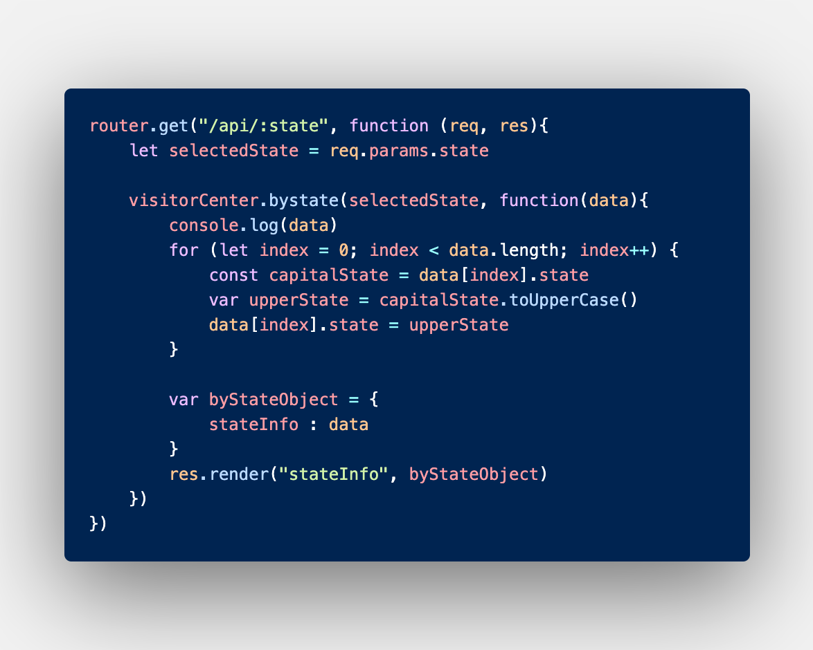
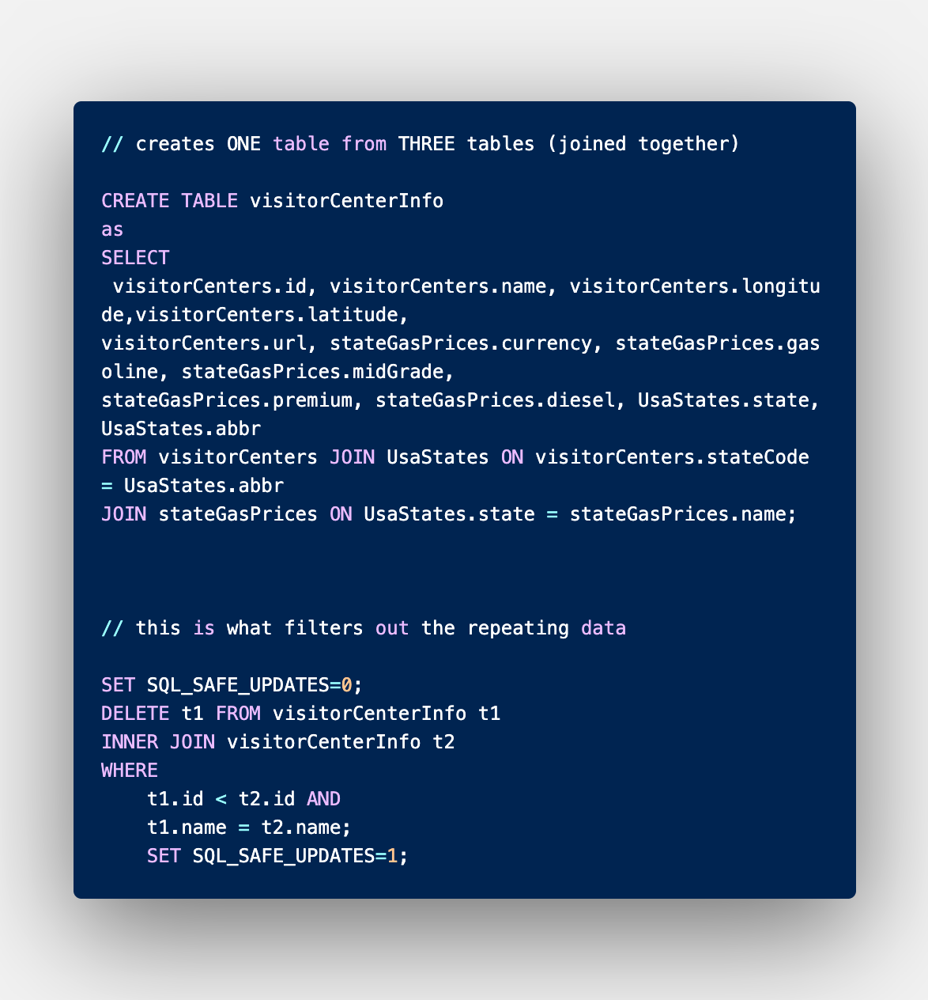

# Visitor Centers Search in the U.S.A.

### This application was made for users to discover visitor centers in the selected state that they are in or are traveling to. It also populates the average gasoline prices for each state!

## Languages Used:
* Handlebars
* CSS
* JavaScript

## Additional:
* Bootstrap CSS
* Ajax
* Express
* Node
* MySQL

## APIs Used:
* National Parks Service API https://rapidapi.com/jonahtaylor/api/national-park-service?endpoint=5a6f76ffe4b0909ecf4ced14
* Gas Price API https://rapidapi.com/collectapi/api/gas-price/endpoints

## Directions:
1. Click on "Choose a State"
2. Select desired state from dropdown list
3. Scroll through the populated area of the page with the Visitor Center's
4. Users have the ability to "Scroll to Top"
5. Users may also click on "Visit Site", where they will be taken to an external window of the specified Visitor Center's website
6. Refresh page to start new search

## Known Errors:
* User must refresh page to begin new search
    * Goal: to have user click on "Welcome to ___" and be taken to the homepage to begin a new search.
* Some states do not have Visitor Center data

## Screenshots:

## Demo: 

